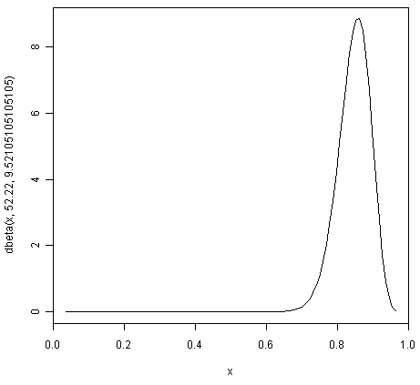

Using R for Bayesian Statistics
===============================

Bayesian Statistics
-------------------

This booklet tells you how to use the R statistical software to carry out some simple 
analyses using Bayesian statistics.

This booklet assumes that the reader has some basic knowledge of Bayesian statistics, and
the principal focus of the booklet is not to explain Bayesian statistics, but rather 
to explain how to carry out these analyses using R.

If you are new to Bayesian statistics, and want to learn more about any of the concepts
presented here, I would highly recommend the Open University book 
"Bayesian Statistics" (product code M249/04), available from
from `the Open University Shop <http://www.ouw.co.uk/store/>`_.

There is a pdf version of this booklet available at
`https://github.com/avrilcoghlan/LittleBookofRBayesianStatistics/ raw/master/_build/latex/BayesianStats.pdf <https://github.com/avrilcoghlan/LittleBookofRBayesianStatistics/raw/master/_build/latex/BayesianStats.pdf>`_.

If you like this booklet, you may also like to check out my booklets on using
R for biomedical statistics, 
`http://a-little-book-of-r-for-biomedical-statistics.readthedocs.org/
<http://a-little-book-of-r-for-biomedical-statistics.readthedocs.org/>`_,
using R for time series analysis,
`http://a-little-book-of-r-for-time-series.readthedocs.org/
<http://a-little-book-of-r-for-time-series.readthedocs.org/>`_,
and using R for multivariate analysis,
`http://little-book-of-r-for-multivariate-analysis.readthedocs.org/
<http://little-book-of-r-for-multivariate-analysis.readthedocs.org/>`_.

Estimating a Proportion
-----------------------

Bayesian analysis can be useful for estimating a proportion, when you have some rough
idea of what the value of the proportion is, but have relatively little data.

Specifying a Prior for a Proportion
^^^^^^^^^^^^^^^^^^^^^^^^^^^^^^^^^^^

An appropriate prior to use for a proportion is a Beta prior.

For example, if you want to estimate the proportion of people like chocolate, you
might have a rough idea that the most likely value is around 0.85, but that the proportion
is unlikely to be smaller than 0.60 or bigger than 0.95. 

You can find the best Beta prior to use in this case by specifying that the median (50\% percentile)
of the prior is 0.85, that the 99.999\% percentile is 0.95, and that the 0.001\% percentile is 0.60:

.. highlight:: r

::

    > quantile1 <- list(p=0.5, x=0.85)    # we believe the median of the prior is 0.85
    > quantile2 <- list(p=0.99999,x=0.95) # we believe the 99.999th percentile of the prior is 0.95
    > quantile3 <- list(p=0.00001,x=0.60) # we believe the 0.001st percentile of the prior is 0.60

We can then use the findBeta() function below to find the most appropriate Beta prior to use.

::

    > findBeta <- function(quantile1,quantile2,quantile3)
      {
         # find the quantiles specified by quantile1 and quantile2 and quantile3
         quantile1_p <- quantile1[[1]]; quantile1_q <- quantile1[[2]]
         quantile2_p <- quantile2[[1]]; quantile2_q <- quantile2[[2]]
         quantile3_p <- quantile3[[1]]; quantile3_q <- quantile3[[2]]

         # find the beta prior using quantile1 and quantile2
         priorA <- beta.select(quantile1,quantile2)
         priorA_a <- priorA[1]; priorA_b <- priorA[2]

         # find the beta prior using quantile1 and quantile3
         priorB <- beta.select(quantile1,quantile3)
         priorB_a <- priorB[1]; priorB_b <- priorB[2]

         # find the best possible beta prior
         diff_a <- abs(priorA_a - priorB_a); diff_b <- abs(priorB_b - priorB_b)
         step_a <- diff_a / 100; step_b <- diff_b / 100
         if (priorA_a < priorB_a) { start_a <- priorA_a; end_a <- priorB_a }
         else                     { start_a <- priorB_a; end_a <- priorA_a }
         if (priorA_b < priorB_b) { start_b <- priorA_b; end_b <- priorB_b }
         else                     { start_b <- priorB_b; end_b <- priorA_b }
         steps_a <- seq(from=start_a, to=end_a, length.out=1000)
         steps_b <- seq(from=start_b, to=end_b, length.out=1000)
         max_error <- 10000000000000000000
         best_a <- 0; best_b <- 0
         for (a in steps_a) 
         {
            for (b in steps_b) 
            {
               # priorC is beta(a,b)
               # find the quantile1_q, quantile2_q, quantile3_q quantiles of priorC: 
               priorC_q1 <- qbeta(c(quantile1_p), a, b)
               priorC_q2 <- qbeta(c(quantile2_p), a, b)
               priorC_q3 <- qbeta(c(quantile3_p), a, b)
               priorC_error <- abs(priorC_q1-quantile1_q) + 
                               abs(priorC_q2-quantile2_q) + 
                               abs(priorC_q3-quantile3_q)
               if (priorC_error < max_error)
               {
                 max_error <- priorC_error; best_a <- a; best_b <- b
               }
           } 
        }
        print(paste("The best beta prior has a=",best_a,"b=",best_b))
      }

To use the findBeta() function, you first need to copy and paste it into R.
The findBeta() function makes use of the beta.select() function from the LearnBayes
R package, so you first need to install the LearnBayes package
(for instructions on how to install an R package, see `How to install an R package 
<./installr.html#how-to-install-an-r-package>`_). 

You can then load the LearnBayes package, and use findBeta() to find the best
Beta prior for a proportion. For example, to find the best Beta prior for the
proportion of individuals who like chocolate, where you believe the most likely
value of the proportion is 0.85, and the value is almost definitely between 0.60 and 0.95, you can
type:

::

    > library("LearnBayes")
    > findBeta(quantile1,quantile2,quantile3)
      [1] "The best beta prior has a= 52.22 b= 9.52105105105105"
     
This tells us that the most appropriate prior to use for the proportion of
individuals who like chocolate is a Beta prior with a=52.22 and b=9.52, that is,
a Beta(52.22, 9.52) prior.

We can plot the prior density by using the "curve" function:

::

    > curve(dbeta(x,52.22,9.52105105105105)) # plot the prior

|image1|

Note that in the command above we use the "dbeta()" function to specify that
the density of a Beta(52.22,9.52105105105105) distribution. 

We can see from the picture of the density for a Beta(52.22,9.52105105105105) distribution
that it represents our prior beliefs about the proportion of people who like chocolate
fairly well, as the peak of the distribution is at about 0.85, and the density lies
almost entirely between about 0.68 and 0.97. 

.. Examples:
.. page 25 of OU book, 
.. quantile1 <- list(p=0.5, x=0.40) 
.. quantile2 <- list(p=0.99999, x=0.9)
.. quantile3 <- list(p=0.00001, x=0.05)
.. findBeta(quantile1,quantile2,quantile3)
.. [1] "The best beta prior has a= 5.14 b= 7.54514514514515" 
.. curve(dbeta(x,5.14,7.545)) # plot the prior 

Links and Further Reading
-------------------------

Here are some links for further reading.

For a more in-depth introduction to R, a good online tutorial is
available on the "Kickstarting R" website,
`cran.r-project.org/doc/contrib/Lemon-kickstart <http://cran.r-project.org/doc/contrib/Lemon-kickstart/>`_.

There is another nice (slightly more in-depth) tutorial to R
available on the "Introduction to R" website,
`cran.r-project.org/doc/manuals/R-intro.html <http://cran.r-project.org/doc/manuals/R-intro.html>`_.

To learn about Bayesian Statistics, I would highly recommend the book "Bayesian
Statistics" (product code M249/04) by the Open University, available from `the Open University Shop
<http://www.ouw.co.uk/store/>`_.

There is a book available in the "Use R!" series on using R for multivariate analyses, 
`Bayesian Computation with R <http://www.springer.com/statistics/statistical+theory+and+methods/book/978-0-387-92297-3>`_ by Jim Albert.

Acknowledgements
----------------

Many of the examples in this booklet are inspired by examples in the excellent Open University book,
"Bayesian Statistics" (product code M249/04), 
available from `the Open University Shop <http://www.ouw.co.uk/store/>`_.

Contact
-------

I will be grateful if you will send me (`Avril Coghlan <http://www.ucc.ie/microbio/avrilcoghlan/>`_) corrections or suggestions for improvements to
my email address a.coghlan@ucc.ie 

License
-------

The content in this book is licensed under a `Creative Commons Attribution 3.0 License
<http://creativecommons.org/licenses/by/3.0/>`_.

